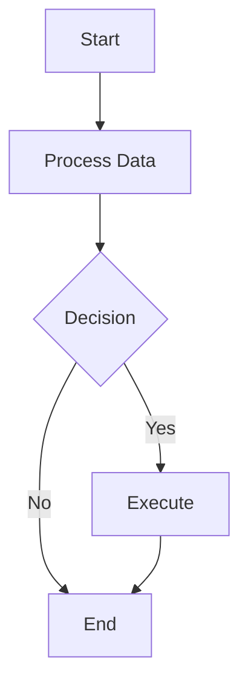
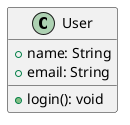

# Markdown Editor — A full-featured WYSIWYG editor for markdown

## 🌐 Language / 语言
[English](#) | [中文](READMECN.md)

## 🎉 Version 1.0.0 - Major Release

### 🌟 All-New Features in v1.0.0

This major update brings powerful new charting, math, and music notation capabilities to your markdown editing experience!

#### 📊 **Comprehensive Chart Support**
- **🎨 Mermaid Charts** - Flowcharts, sequence diagrams, pie charts, and more
- **🏗️ PlantUML Diagrams** - UML class diagrams, use cases, sequence diagrams
- **📈 ECharts Visualizations** - Interactive data charts and graphs
- **🎼 Music Notation** - ABC notation for sheet music and musical scores
- **🧮 Mathematical Formulas** - KaTeX-powered math expressions (both block and inline)

#### 📤 **Export Functionality**
- **🖨️ PDF Export** - Export documents to PDF format with full styling and layout preservation
- **📄 Word Export** - Export to Word documents with embedded images and complete formatting
- **🌐 HTML Export** - Generate standalone HTML files with interactive charts and formulas
- **🎨 Table Border Support** - Complete table styling with borders and proper formatting
- **📊 Chart Export** - All charts (Mermaid, PlantUML, ECharts) properly rendered in exported documents
- **🖼️ Image Export** - Images embedded and preserved across all export formats

#### ⌨️ **Enhanced Toolbar Experience**
- **Main Toolbar Buttons** - All chart and math tools are now primary toolbar buttons
- **Smart Shortcuts** - Quick access with Cmd/Ctrl + Shift shortcuts
- **Theme-Adaptive Icons** - Icons that automatically match your VS Code theme
- **One-Click Templates** - Pre-configured templates for instant use

#### 🎯 **Quick Access Shortcuts**
| Feature | Shortcut | Description |
|--------|----------|-------------|
| Insert Image | ⌘+Shift+I | Insert Markdown image syntax |
| Mermaid Chart | ⌘+Shift+M | Insert Mermaid flowchart/diagram |
| PlantUML Diagram | ⌘+Shift+P | Insert UML diagram |
| ECharts Visualization | ⌘+Shift+E | Insert data chart |
| Music Notation | ⌘+Shift+N | Insert ABC music notation |
| Math Formula Block | ⌘+Shift+B | Insert mathematical formula |
| Inline Math Formula | ⌘+Shift+U | Insert inline math expression |
| Export Document | 📤 | Choose PDF, Word, or HTML export |

#### 🔄 **Enhanced Rendering Engine**
- **vditor 3.11.2** - Latest version with improved performance
- **KaTeX Integration** - Fast and accurate math formula rendering
- **Multiple Rendering Servers** - Improved PlantUML reliability with backup servers
- **Local Rendering Support** - Enhanced offline capabilities

### 🎨 Previous Features (Retained)

- **External CSS Support** - Load CSS files from URLs or local paths
- **Enhanced Editor Options** - Configurable outline and display settings
- **Multi-theme Support** - Light and dark themes
- **Split View Mode** - Edit and preview simultaneously
- **Auto-sync** - Real-time synchronization with VS Code editor

## 🖼️ Feature Showcase

### Chart Examples

**Mermaid Flowchart:**


**PlantUML Class Diagram:**


**ECharts Bar Chart:**
```echarts
{
  "title": { "text": "Sales Data" },
  "xAxis": { "data": ["Jan", "Feb", "Mar"] },
  "series": [{
    "type": "bar",
    "data": [120, 200, 150]
  }]
}
```

**Mathematical Formulas:**
$$
\int_{-\infty}^{\infty} e^{-x^2} dx = \sqrt{\pi}
$$

Inline formula: $E = mc^2$

### 🔧 Configuration Options

All configuration options available:

- `markdown-editor.externalCssFiles` - Array of external CSS file paths/URLs
- `markdown-editor.cssLoadOrder` - Control CSS loading priority
- `markdown-editor.outlineDisplaySetting` - Configure outline panel behavior
- `markdown-editor.showToolbar` - Show/hide toolbar
- `markdown-editor.useVscodeThemeColor` - Use VS Code theme colors
- `markdown-editor.isDefault` - Set as default markdown editor

## 🎯 Core Features

- **🎨 Rich Chart Support** - Mermaid, PlantUML, ECharts, ABC notation, mathematical formulas
- **📝 WYSIWYG Editing** - What You See Is What You Get editing experience
- **🔄 Real-time Sync** - Auto sync changes between VSCode editor and webview
- **📋 Multi-format Support** - Copy markdown/html, paste images
- **🖼️ Theme Integration** - Uses VS Code theme colors automatically
- **⌨️ Keyboard Shortcuts** - Comprehensive shortcut key support
- **👁️ Multiple Editing Modes** - IR mode, WYSIWYG mode, split screen mode
- **📱 Responsive Design** - Adapts to different window sizes
- **🔧 Extensibility** - Custom CSS and configuration support

## 🚀 Installation

```
Download the visx installation package from the release and drag it into VSCode/cursor…
```

## 🎮 Usage

### 1. **Command Palette**

- Open a markdown file
- Press `Cmd+Shift+P` (Mac) or `Ctrl+Shift+P` (Windows/Linux)
- Type `markdown-editor: Open with markdown editor`

### 2. **Keyboard Shortcut**
- Open a markdown file
- Press `Cmd+Shift+Alt+M` (Mac) or `Ctrl+Shift+Alt+M` (Windows/Linux)

### 3. **Explorer Context Menu**
- Right-click on any `.md` file
- Select `Open with markdown editor`

### 4. **Editor Title Context Menu**
- Right-click on a markdown file's tab title
- Select `Open with markdown editor`

### 5. **Split View Button**
- Click the pencil icon in the editor title bar
- Opens in split view with source and preview

## ⌨️ Keyboard Shortcuts

| Action | Mac | Windows/Linux |
|--------|-----|---------------|
| Open Editor | `Cmd+Shift+Alt+M` | `Ctrl+Shift+Alt+M` |
| Save | `Cmd+S` | `Ctrl+S` |
| Mermaid Chart | `Cmd+Shift+M` | `Ctrl+Shift+M` |
| PlantUML Diagram | `Cmd+Shift+P` | `Ctrl+Shift+P` |
| ECharts Chart | `Cmd+Shift+E` | `Ctrl+Shift+E` |
| Music Notation | `Cmd+Shift+N` | `Ctrl+Shift+N` |
| Math Formula Block | `Cmd+Shift+B` | `Ctrl+Shift+B` |
| Inline Math Formula | `Cmd+Shift+I` | `Ctrl+Shift+I` |

## 🌟 Supported Syntax

The editor supports all standard markdown syntax plus extensive extensions:

- **📝 Standard Markdown** - Headers, lists, tables, links, images
- **🎨 Extended Syntax** - Footnotes, task lists, strikethrough, highlight
- **📊 Charts & Diagrams** - Mermaid, PlantUML, ECharts, flowcharts
- **🧮 Mathematical Formulas** - KaTeX math expressions (block and inline)
- **🎼 Music Notation** - ABC notation for sheet music
- **💻 Code Blocks** - Syntax highlighting for 100+ languages
- **🔗 Auto-linking** - URLs and emails automatically linked

See the [complete syntax guide](https://ld246.com/guide/markdown) for detailed examples.

## 🔧 Development

### Getting Started

Clone the repository and install dependencies:

```bash
git clone https://github.com/zaaack/vscode-markdown-editor.git
cd vscode-markdown-editor
npm install
```

### Development Workflow

```bash
# Start development with hot reload
npm run watch

# Build for production
npm run build

# Create VSIX package
npm run package

# Publish to marketplace (with version bump)
npm run publish

# Publish without version bump
npm run publish:skip-version
```

For detailed build instructions, see [scripts/README.md](./scripts/README.md).

### 🎨 Customization

#### Custom CSS
Edit your VS Code settings to add custom CSS:

```json
{
  "markdown-editor.customCss": ".vditor-ir pre.vditor-reset { line-height: 32px; font-family: system-ui; }"
}
```

#### External CSS Files
Load external CSS files:

```json
{
  "markdown-editor.externalCssFiles": [
    "https://cdn.jsdelivr.net/npm/github-markdown-css@5/github-markdown.min.css",
    "./styles/custom.css"
  ]
}
```

#### Custom Configuration
All other settings can be configured through VS Code settings under the `markdown-editor.*` namespace.

## 🤝 Contributing

Contributions are welcome! Please read the [Contributing Guidelines](CONTRIBUTING.md) before submitting pull requests.

### Development Setup

1. Fork the repository
2. Create a feature branch
3. Make your changes
4. Test thoroughly
5. Submit a pull request

## 🙏 Acknowledgements

This extension is built upon the amazing work of:

- **[VS Code](https://github.com/microsoft/vscode)** - The best code editor
- **[vditor](https://github.com/Vanessa219/vditor)** - Powerful markdown editor engine
- **[KaTeX](https://katex.org/)** - Fast math typesetting library
- **[Mermaid](https://mermaid-js.org/)** - Diagramming and charting tool
- **[PlantUML](https://plantuml.com/)** - UML diagram generator
- **[ECharts](https://echarts.apache.org/)** - Data visualization library

## 📋 Todo

- [ ] Enhanced mobile support
- [ ] Collaborative editing features
- [ ] Advanced export options
- [ ] Plugin system for custom extensions
- [ ] Integration with popular services (GitHub, GitLab, etc.)

## 📄 License

[](https://opensource.org/licenses/MIT)

## ❤️ Support

If you find this extension helpful:

- ⭐ **Star the repository** on GitHub
- 🐛 **Report issues** with detailed reproduction steps
- 💬 **Share feedback** and feature requests

---

**Version 1.0.0** - The most feature-rich markdown editor for VS Code! 🎉
- [vditor](https://github.com/Vanessa219/vditor)

## License

MIT

```
123
```

## Support

If you like this extension make sure to star the repo. I am always looking for new ideas and feedback. 
