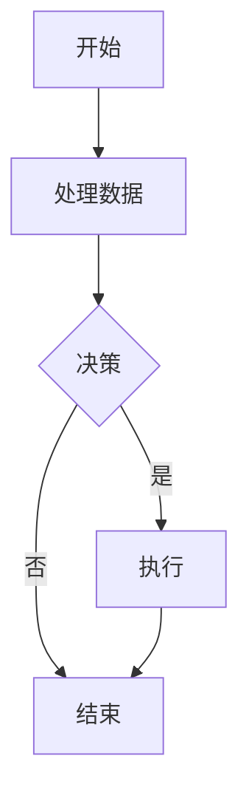
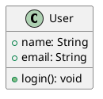

# Markdown Editor — 功能丰富的所见即所得 Markdown 编辑器

## 🎉 版本 1.0.0 - 重大版本发布

### 🌟 v1.0.0 全新功能

本次重大更新为您的 Markdown 编辑体验带来了强大的图表、数学和音乐记谱功能！

#### 📊 **全面的图表支持**
- **🎨 Mermaid 图表** - 流程图、序列图、饼图等
- **🏗️ PlantUML 图表** - UML 类图、用例图、序列图
- **📈 ECharts 可视化** - 交互式数据图表和图形
- **🎼 音乐记谱** - 五线谱和音乐符号的 ABC 记谱法
- **🧮 数学公式** - KaTeX 驱动的数学表达式（块级和行内）

#### ⌨️ **增强的工具栏体验**
- **主工具栏按钮** - 所有图表和数学工具现在都是主工具栏按钮
- **智能快捷键** - 使用 Cmd/Ctrl + Shift 快速访问
- **主题自适应图标** - 图标自动匹配您的 VS Code 主题
- **一键模板** - 预配置模板，即时使用

#### 🎯 **快速访问快捷键**
| 功能 | 快捷键 | 描述 |
|--------|----------|-------------|
| 插入图片 | ⌘+Shift+I | 插入 Markdown 图片语法 |
| Mermaid 图表 | ⌘+Shift+M | 插入 Mermaid 流程图/图表 |
| PlantUML 图表 | ⌘+Shift+P | 插入 UML 图表 |
| ECharts 可视化 | ⌘+Shift+E | 插入数据图表 |
| 音乐记谱 | ⌘+Shift+N | 插入 ABC 音乐记谱 |
| 数学公式块 | ⌘+Shift+B | 插入数学公式 |
| 行内数学公式 | ⌘+Shift+U | 插入行内数学表达式 |

#### 🔄 **增强的渲染引擎**
- **vditor 3.11.2** - 最新版本，性能和稳定性改进
- **KaTeX 集成** - 快速准确的数学公式渲染
- **多服务器支持** - 改进的 PlantUML 可靠性和备用服务器
- **本地渲染支持** - 增强的离线能力

### 🎨 保留的旧版本功能

- **外部 CSS 支持** - 从 URL 或本地路径加载 CSS 文件
- **增强的编辑器选项** - 可配置的大纲和显示设置
- **多主题支持** - 明暗主题
- **分屏视图模式** - 同时编辑和预览
- **自动同步** - 与 VS Code 编辑器实时同步

## 🖼️ 功能展示

### 图表示例

**Mermaid 流程图:**


**PlantUML 类图:**


**ECharts 柱状图:**
```echarts
{
  "title": { "text": "销售数据" },
  "xAxis": { "data": ["一月", "二月", "三月"] },
  "series": [{
    "type": "bar",
    "data": [120, 200, 150]
  }]
}
```

**数学公式:**
$$
\int_{-\infty}^{\infty} e^{-x^2} dx = \sqrt{\pi}
$$

行内公式：$E = mc^2$

### 🔧 配置选项

所有可用的配置选项：

- `markdown-editor.externalCssFiles` - 外部 CSS 文件路径/URL 数组
- `markdown-editor.cssLoadOrder` - 控制 CSS 加载优先级
- `markdown-editor.outlineDisplaySetting` - 配置大纲面板行为
- `markdown-editor.showToolbar` - 显示/隐藏工具栏
- `markdown-editor.useVscodeThemeColor` - 使用 VS Code 主题颜色
- `markdown-editor.isDefault` - 设置为默认 Markdown 编辑器

## 🎯 核心功能

- **🎨 丰富的图表支持** - Mermaid、PlantUML、ECharts、ABC 记谱法、数学公式
- **📝 所见即所得编辑** - 所见即所得的编辑体验
- **🔄 实时同步** - VSCode 编辑器和 Web 视图之间的自动同步
- **📋 多格式支持** - 复制 markdown/html，粘贴图片
- **🖼️ 主题集成** - 自动使用 VS Code 主题颜色
- **⌨️ 键盘快捷键** - 全面的快捷键支持
- **👁️ 多种编辑模式** - 即时渲染模式、所见即所得模式、分屏模式
- **📱 响应式设计** - 适应不同窗口大小
- **🔧 可扩展性** - 自定义 CSS 和配置支持

## 🚀 安装

[](https://marketplace.visualstudio.com/items?itemName=zaaack.markdown-editor)

从 [VS Code Marketplace](https://marketplace.visualstudio.com/items?itemName=zaaack.markdown-editor) 安装

## 🎮 使用方法

### 1. **命令面板**
- 打开一个 Markdown 文件
- 按 `Cmd+Shift+P` (Mac) 或 `Ctrl+Shift+P` (Windows/Linux)
- 输入 `markdown-editor: 使用 Markdown 编辑器打开`

### 2. **键盘快捷键**
- 打开一个 Markdown 文件
- 按 `Cmd+Shift+Alt+M` (Mac) 或 `Ctrl+Shift+Alt+M` (Windows/Linux)

### 3. **资源管理器右键菜单**
- 右键点击任何 `.md` 文件
- 选择 `使用 Markdown 编辑器打开`

### 4. **编辑器标题右键菜单**
- 右键点击 Markdown 文件的标签标题
- 选择 `使用 Markdown 编辑器打开`

### 5. **分屏视图按钮**
- 点击编辑器标题栏中的铅笔图标
- 在包含源代码和预览的分屏视图中打开

## ⌨️ 键盘快捷键

| 操作 | Mac | Windows/Linux |
|--------|-----|---------------|
| 打开编辑器 | `Cmd+Shift+Alt+M` | `Ctrl+Shift+Alt+M` |
| 保存 | `Cmd+S` | `Ctrl+S` |
| 插入图片 | `Cmd+Shift+I` | `Ctrl+Shift+I` |
| Mermaid 图表 | `Cmd+Shift+M` | `Ctrl+Shift+M` |
| PlantUML 图表 | `Cmd+Shift+P` | `Ctrl+Shift+P` |
| ECharts 图表 | `Cmd+Shift+E` | `Ctrl+Shift+E` |
| 音乐记谱 | `Cmd+Shift+N` | `Ctrl+Shift+N` |
| 数学公式块 | `Cmd+Shift+B` | `Ctrl+Shift+B` |
| 行内数学公式 | `Cmd+Shift+U` | `Ctrl+Shift+U` |

## 🌟 支持的语法

编辑器支持所有标准 Markdown 语法及广泛扩展：

- **📝 标准 Markdown** - 标题、列表、表格、链接、图片
- **🎨 扩展语法** - 脚注、任务列表、删除线、高亮
- **📊 图表和图表** - Mermaid、PlantUML、ECharts、流程图
- **🧮 数学公式** - KaTeX 数学表达式（块级和行内）
- **🎼 音乐记谱** - 五线谱的 ABC 记谱法
- **💻 代码块** - 100+ 种语言的语法高亮
- **🔗 自动链接** - URL 和电子邮件自动链接

有关详细示例，请参阅[完整语法指南](https://ld246.com/guide/markdown)。

## 🔧 开发

### 入门指南

克隆仓库并安装依赖：

```bash
git clone https://github.com/zaaack/vscode-markdown-editor.git
cd vscode-markdown-editor
npm install
```

### 开发工作流

```bash
# 使用热重载开始开发
npm run watch

# 生产构建
npm run build

# 创建 VSIX 包
npm run package

# 发布到市场（带版本升级）
npm run publish

# 无版本升级发布
npm run publish:skip-version
```

有关详细构建说明，请参阅 [scripts/README.md](./scripts/README.md)。

### 🎨 自定义

#### 自定义 CSS
编辑您的 VS Code 设置以添加自定义 CSS：

```json
{
  "markdown-editor.customCss": ".vditor-ir pre.vditor-reset { line-height: 32px; font-family: system-ui; }"
}
```

#### 外部 CSS 文件
加载外部 CSS 文件：

```json
{
  "markdown-editor.externalCssFiles": [
    "https://cdn.jsdelivr.net/npm/github-markdown-css@5/github-markdown.min.css",
    "./styles/custom.css"
  ]
}
```

#### 自定义配置
所有其他设置都可以通过 VS Code 设置中的 `markdown-editor.*` 命名空间进行配置。

## 🤝 贡献

欢迎贡献！在提交 Pull Request 之前，请阅读[贡献指南](CONTRIBUTING.md)。

### 开发设置

1. Fork 仓库
2. 创建功能分支
3. 进行更改
4. 充分测试
5. 提交 Pull Request

## 🙏 致谢

此扩展建立在以下项目的出色工作基础上：

- **[VS Code](https://github.com/microsoft/vscode)** - 最好的代码编辑器
- **[vditor](https://github.com/Vanessa219/vditor)** - 强大的 Markdown 编辑器引擎
- **[KaTeX](https://katex.org/)** - 快速的数学排版库
- **[Mermaid](https://mermaid-js.org/)** - 图表和图表工具
- **[PlantUML](https://plantuml.com/)** - UML 图表生成器
- **[ECharts](https://echarts.apache.org/)** - 数据可视化库

## 📋 待办事项

- [ ] 增强移动端支持
- [ ] 协作编辑功能
- [ ] 高级导出选项
- [ ] 自定义扩展的插件系统
- [ ] 与流行服务（GitHub、GitLab 等）的集成

## 📄 许可证

[](https://opensource.org/licenses/MIT)

## ❤️ 支持

如果您觉得此扩展有帮助：

- ⭐ **在 GitHub 上为仓库点赞**
- 🐛 **报告问题**并提供详细的复现步骤
- 💬 **分享反馈**和功能请求
- ☕️ [通过 PayPal 捐赠](https://www.paypal.me/zaaack) 以支持持续开发

## 📞 获取帮助

- **文档**：查看此 README 和 [Wiki](https://github.com/zaaack/vscode-markdown-editor/wiki)
- **问题**：[报告错误或请求功能](https://github.com/zaaack/vscode-markdown-editor/issues)
- **讨论**：[提问或分享想法](https://github.com/zaaack/vscode-markdown-editor/discussions)

---

**版本 1.0.0** - VS Code 最功能丰富的 Markdown 编辑器！🎉
- [vditor](https://github.com/Vanessa219/vditor)

## 待办事项

- [ ] 使用[自定义文本编辑器](https://code.visualstudio.com/api/extension-guides/custom-editors#custom-text-editor)（[演示](https://github.com/gera2ld/markmap-vscode)）

## 许可证

MIT

```
123
```

## 支持

如果您喜欢此扩展，请确保为仓库点赞。我总是在寻找新的想法和反馈。此外，可以通过 [paypal 捐赠](https://www.paypal.me/zaaack)。