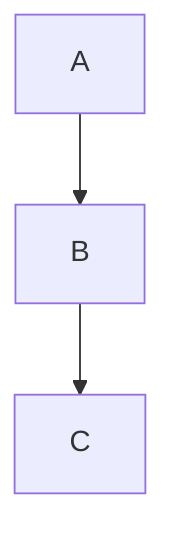
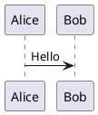

# 📤 导出功能使用指南

## 🎯 功能概述

Markdown Editor 提供了强大的导出功能，支持将您的 Markdown 文档导出为多种格式，包括 PDF、Word 和 HTML。所有导出功能都完整保留文档的格式、样式、图表、图片和数学公式。

## 🚀 快速开始

### 使用方法

1. **打开您的 Markdown 文档**
2. **点击工具栏中的导出按钮** 📤
3. **选择导出格式**：
   - PDF - 通过浏览器打印功能生成 PDF
   - Word - 下载包含完整格式的 Word 文档
   - HTML - 生成独立的 HTML 文件

### 导出按钮位置

导出按钮位于工具栏中，在链接按钮的右侧：

```
保存 | Emoji 标题 粗体 斜体 | 链接 📤 | 列表 有序列表...
```

## 🖨️ PDF 导出

### 特性
- ✅ 完整的页面布局和样式
- ✅ 表格边框和格式
- ✅ 图片正确显示
- ✅ 数学公式渲染
- ✅ 图表（Mermaid、PlantUML、ECharts）显示
- ✅ 专业的打印样式

### 导出步骤
1. 点击导出按钮 → 选择 "导出为 PDF"
2. 系统会打开一个新的浏览器标签页
3. 在浏览器中选择 "打印" 或按 `Ctrl+P` (Windows) / `Cmd+P` (Mac)
4. 在打印对话框中选择"另存为 PDF"或"保存为 PDF"
5. 保存 PDF 文件

### 最佳实践
- **页面设置**：使用 A4 纸张大小，2cm 边距
- **字体选择**：自动使用系统字体，确保最佳显示效果
- **图表处理**：静态渲染，保持清晰度
- **分页控制**：自动分页，避免内容被截断

## 📄 Word 导出

### 特性
- ✅ 完整的 Word 文档格式 (.doc)
- ✅ 嵌入式图片（Base64 编码）
- ✅ 表格边框和样式
- ✅ 数学公式保留
- ✅ 图表框架显示
- ✅ 兼容 Microsoft Word

### 导出步骤
1. 点击导出按钮 → 选择 "导出为 Word"
2. 系统会自动下载 `.doc` 文件
3. 使用 Microsoft Word 或 WPS Office 打开
4. 享受完整的文档编辑体验

### 技术细节
- **图片处理**：网络图片自动转换为 Base64 并嵌入
- **样式支持**：完整的 CSS 样式转换
- **兼容性**：支持 Word 2007 及以上版本
- **布局**：保持原始文档的布局结构

## 🌐 HTML 导出

### 特性
- ✅ 独立的 HTML 文件
- ✅ 交互式图表（ECharts 可交互）
- ✅ 动态数学公式渲染
- ✅ 响应式设计
- ✅ 完整的样式和脚本
- ✅ 离线可用

### 导出步骤
1. 点击导出按钮 → 选择 "导出为 HTML"
2. 系统会自动下载 `.html` 文件
3. 在浏览器中打开查看
4. 可以分享或发布到网上

### 技术特点
- **脚本支持**：包含 KaTeX、Mermaid、ECharts 的渲染脚本
- **响应式设计**：适配不同屏幕尺寸
- **图片处理**：保持图片链接和显示
- **交互功能**：ECharts 图表保持交互性

## 🎨 格式支持详解

### 表格支持

所有导出格式都完整支持表格格式：

```markdown
| 姓名 | 年龄 | 部门 |
|------|------|------|
| 张三 | 28 | 技术部 |
| 李四 | 32 | 产品部 |
```

**导出效果**：
- ✅ 完整的表格边框
- ✅ 表头样式
- ✅ 单元格对齐
- ✅ 斑马纹效果（HTML 格式）

### 图片支持

#### 网络图片
```markdown

```

**处理方式**：
- **PDF**：直接显示
- **Word**：转换为 Base64 嵌入
- **HTML**：保持原始链接

#### 本地图片
```markdown

```

**注意**：本地图片需要与 HTML 文件在同一目录下才能正确显示。

### 图表支持

#### Mermaid 图表
```markdown

```

**渲染方式**：
- **PDF**：静态图像渲染
- **Word**：图表框架显示
- **HTML**：完整的 Mermaid 交互式渲染

#### PlantUML 图表
```markdown

```

**渲染方式**：
- **PDF**：通过 PlantUML 服务器生成图像
- **Word**：SVG 图像嵌入
- **HTML**：动态 SVG 生成

#### ECharts 图表
```markdown
```echarts
{
  "xAxis": {"data": ["A", "B", "C"]},
  "series": [{"type": "bar", "data": [1, 2, 3]}]
}
```
```

**渲染方式**：
- **PDF**：静态图像
- **Word**：图像占位符
- **HTML**：完整的交互式图表

### 数学公式支持

#### 块级公式
```markdown
$$
E = mc^2
$$
```

#### 行内公式
```markdown
质能方程：$E = mc^2$
```

**渲染方式**：
- **PDF**：KaTeX 渲染的数学公式
- **Word**：Unicode 数学字符
- **HTML**：KaTeX 动态渲染

## 🔧 高级功能

### 自定义样式

导出的文档会应用以下样式：

#### PDF 样式
- 字体：系统默认字体
- 边距：40px
- 行高：1.6
- 表格：完整边框样式

#### Word 样式
- 字体：Segoe UI
- 页面：A4，2cm 边距
- 表格：1pt 边框
- 标题：分级样式

#### HTML 样式
- 响应式设计
- 主题色彩
- 阴影和圆角
- 悬停效果

### 性能优化

#### 图片优化
- **Word 导出**：自动压缩图片
- **HTML 导出**：懒加载支持
- **PDF 导出**：保持原始分辨率

#### 图表优化
- **异步加载**：防止阻塞页面渲染
- **错误处理**：图表加载失败时的回退方案
- **缓存机制**：提高渲染性能

## 🚨 注意事项

### 兼容性
- **Word 导出**：建议使用 Microsoft Word 2007 或更高版本
- **PDF 导出**：建议使用 Chrome、Firefox、Safari 或 Edge 浏览器
- **HTML 导出**：现代浏览器支持，IE 可能无法完全显示

### 文件大小
- **Word 文档**：包含嵌入图片，文件可能较大
- **HTML 文件**：包含外部库，首次加载需要网络连接
- **PDF 文件**：相对较小，适合分享

### 安全性
- 所有导出都在本地完成，不会上传到服务器
- 图片处理仅在必要时进行网络请求
- 生成的文件不包含任何恶意代码

## 🔍 故障排除

### 常见问题

#### PDF 导出问题
**问题**：PDF 中图表显示不正确
**解决**：
1. 确保浏览器允许弹窗
2. 检查网络连接（用于图表渲染）
3. 尝试刷新页面后再打印

#### Word 导出问题
**问题**：Word 文档打开异常
**解决**：
1. 使用兼容的 Word 版本
2. 检查文件是否损坏
3. 尝试重新导出

#### HTML 导出问题
**问题**：HTML 文件中图表不显示
**解决**：
1. 检查网络连接
2. 确保浏览器支持 JavaScript
3. 检查浏览器控制台的错误信息

### 错误处理

如果导出过程中遇到错误，系统会显示相应的错误信息：

- **网络错误**：检查网络连接
- **权限错误**：检查浏览器权限设置
- **格式错误**：检查文档格式是否正确

## 📞 技术支持

如果您在使用导出功能时遇到问题：

1. **查看错误信息**：注意系统提示的具体错误
2. **检查文档格式**：确保 Markdown 语法正确
3. **测试简单文档**：先用简单文档测试导出功能
4. **更新浏览器**：确保使用最新版本的浏览器
5. **反馈问题**：通过 GitHub Issues 报告问题

## 🎉 总结

Markdown Editor 的导出功能提供了完整的文档导出解决方案：

- **🖨️ PDF 导出**：适合正式文档分享和打印
- **📄 Word 导出**：适合进一步编辑和协作
- **🌐 HTML 导出**：适合网络发布和交互式展示

所有导出格式都完整保留了您的文档内容、样式和交互性，确保最佳的导出体验！