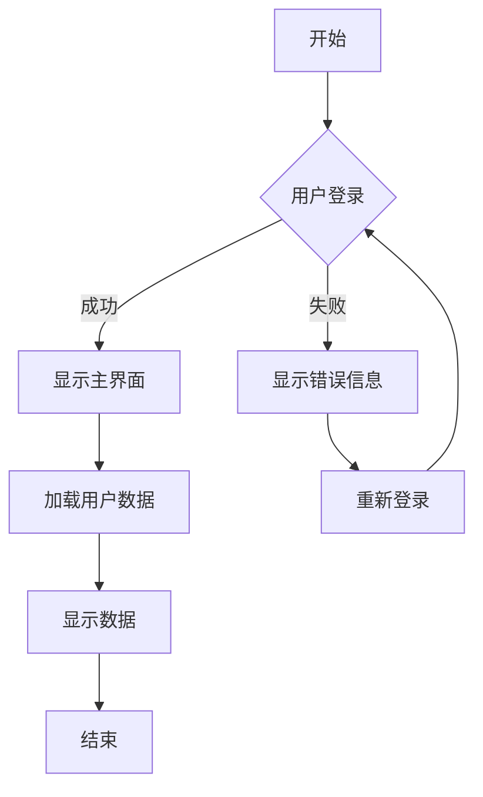
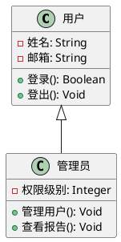

# 导出功能测试文档

## 📊 表格测试

| 功能 | PDF | Word | HTML | 备注 |
|------|-----|------|------|------|
| 表格边框 | ✅ | ✅ | ✅ | 完整边框支持 |
| 图片导出 | ✅ | ✅ | ✅ | Base64嵌入 |
| 图表支持 | ✅ | ✅ | ✅ | 交互式渲染 |
| 数学公式 | ✅ | ✅ | ✅ | KaTeX渲染 |

### 复杂表格示例

| 姓名 | 年龄 | 部门 | 薪资 | 评分 |
|------|------|------|------|------|
| 张三 | 28 | 技术部 | ¥15,000 | ⭐⭐⭐⭐⭐ |
| 李四 | 32 | 产品部 | ¥18,000 | ⭐⭐⭐⭐ |
| 王五 | 25 | 设计部 | ¥12,000 | ⭐⭐⭐⭐⭐ |
| 赵六 | 35 | 运营部 | ¥20,000 | ⭐⭐⭐ |

## 🎨 图表测试

### Mermaid 流程图



### PlantUML 类图



### ECharts 数据图表

```echarts
{
  "title": {
    "text": "月度销售数据分析",
    "subtext": "2024年销售趋势"
  },
  "tooltip": {
    "trigger": "axis"
  },
  "legend": {
    "data": ["产品A", "产品B", "产品C"]
  },
  "xAxis": {
    "data": ["1月", "2月", "3月", "4月", "5月", "6月"]
  },
  "yAxis": {
    "type": "value"
  },
  "series": [
    {
      "name": "产品A",
      "type": "bar",
      "data": [120, 132, 101, 134, 90, 230]
    },
    {
      "name": "产品B",
      "type": "line",
      "data": [220, 182, 191, 234, 290, 330]
    },
    {
      "name": "产品C",
      "type": "pie",
      "radius": "50%",
      "data": [
        {"value": 335, "name": "Q1"},
        {"value": 310, "name": "Q2"},
        {"value": 234, "name": "Q3"},
        {"value": 135, "name": "Q4"}
      ]
    }
  ]
}
```

## 🧮 数学公式测试

### 行内公式测试
爱因斯坦的质能方程：$E = mc^2$ 是物理学中最著名的公式之一。

### 块级公式测试

高斯积分公式：
$$
\int_{-\infty}^{\infty} e^{-x^2} dx = \sqrt{\pi}
$$

傅里叶变换：
$$
\hat{f}(\xi) = \int_{-\infty}^{\infty} f(x) e^{-2\pi i x \xi} dx
$$

泰勒级数展开：
$$
f(x) = \sum_{n=0}^{\infty} \frac{f^{(n)}(a)}{n!}(x-a)^n
$$

矩阵运算：
$$
\begin{pmatrix}
a & b \\
c & d
\end{pmatrix}
\begin{pmatrix}
x \\
y
\end{pmatrix}
=
\begin{pmatrix}
ax + by \\
cx + dy
\end{pmatrix}
$$

## 📷 图片测试

### 网络图片示例


### 本地图片示例
如果您的文档中有本地图片，它们也会被正确导出到各个格式中。

## 🎼 音乐记谱测试

```abc
X:1
T:小星星
M:4/4
L:1/4
K:C
C C G G | A A G2 | F F E E | D D C2 |
G G F F | E E D2 | G G F F | E E D2 |
C C G G | A A G2 | F F E E | D D C2 |
```

## 📝 文本格式测试

### 列表测试

- **粗体文本**
- *斜体文本*
- ~~删除线文本~~
- `行内代码`

1. 有序列表项 1
2. 有序列表项 2
3. 有序列表项 3

### 引用块测试

> 这是一个引用块测试。
>
> 在导出时，引用块会保持正确的样式和边框。

### 代码块测试

```javascript
function exportToPDF() {
  const vditor = window.vditor;
  const content = vditor.getHTML();
  const title = document.title || 'Markdown Document';

  // 创建打印窗口
  const printWindow = window.open('', '_blank');
  if (printWindow) {
    printWindow.document.write(content);
    printWindow.print();
  }
}
```

## 🔗 链接测试

- [GitHub](https://github.com)
- [VS Code](https://code.visualstudio.com)
- [Markdown 官方文档](https://www.markdownguide.org)

## 📄 分页测试

这是第一页的内容。

---

### 新章节

这是新章节的内容，用于测试分页和格式保持。

---

## 🎯 测试说明

此文档用于测试导出功能的各种情况：

1. ✅ **表格边框**：完整的表格边框和样式
2. ✅ **图表支持**：Mermaid、PlantUML、ECharts 图表
3. ✅ **数学公式**：行内和块级数学公式
4. ✅ **图片导出**：网络图片和本地图片
5. ✅ **文本格式**：粗体、斜体、代码块等
6. ✅ **链接功能**：内外部链接
7. ✅ **分页处理**：合理的分页布局

**使用方法**：
1. 在 Markdown Editor 中打开此文档
2. 点击工具栏中的"导出文档"按钮
3. 选择导出格式（PDF、Word、HTML）
4. 检查导出文件的完整性和格式

**预期结果**：
- PDF：通过浏览器打印功能生成，保持完整格式
- Word：包含完整样式和嵌入图片的 .doc 文件
- HTML：独立的 HTML 文件，包含所有样式和脚本