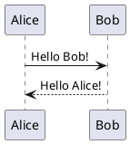
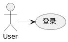
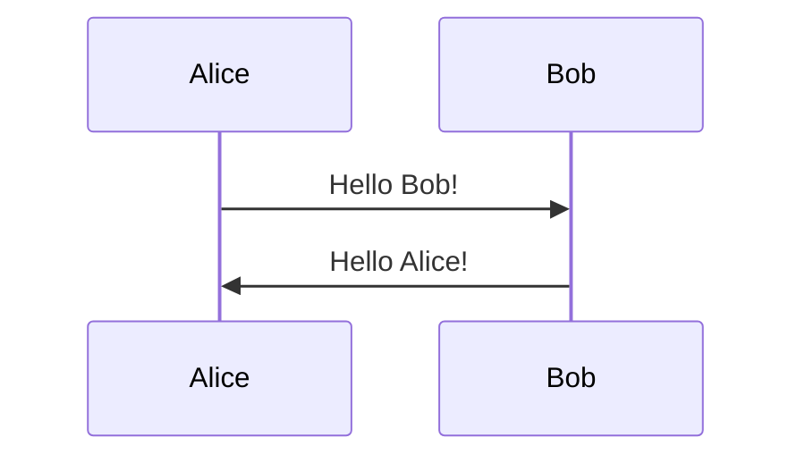
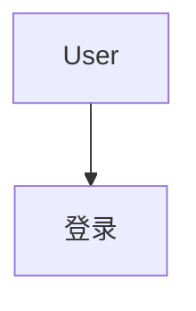

# PlantUML 渲染测试

## 简单的 PlantUML 时序图

## 简单的 PlantUML 用例图

## 检查列表

- [x] PlantUML 语法正确
- [x] 使用了 @startuml 和 @enduml
- [x] 测试简单图形

## 可能的问题排查

如果 PlantUML 不显示，可能的原因：
1. 网络连接问题（PlantUML 需要远程服务器渲染）
2. CDN 资源加载失败
3. vditor 版本兼容性问题

## 替代方案

如果 PlantUML 不工作，可以使用 Mermaid 替代：

