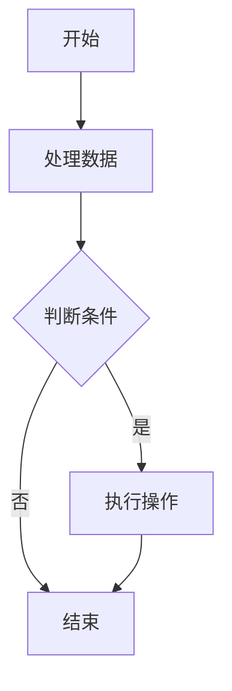
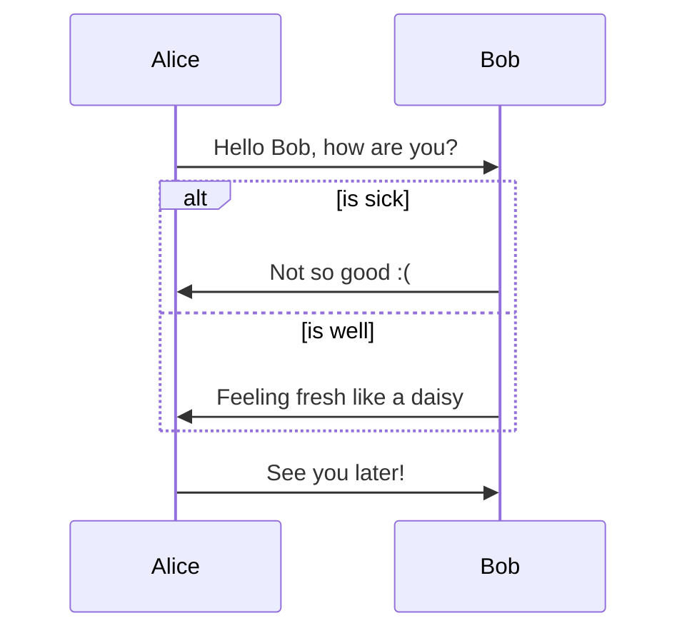
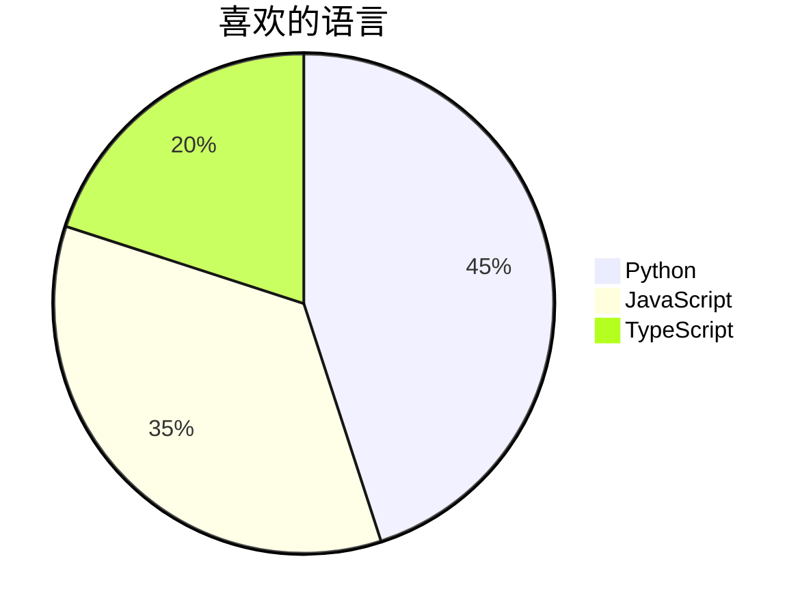
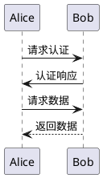
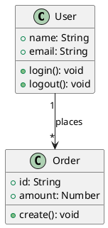
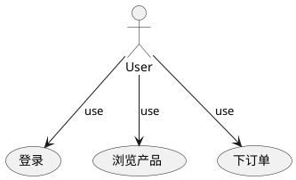

# 📊 图表与数学公式功能测试

## 🎨 Mermaid 图表测试

### 流程图


### 时序图


### 饼图


## 🏗️ PlantUML 图表测试

### 时序图


### 类图


### 用例图


## 📈 ECharts 图表测试

### 柱状图
```echarts
{
  "title": {
    "text": "月销售数据"
  },
  "tooltip": {},
  "legend": {
    "data": ["销量"]
  },
  "xAxis": {
    "data": ["一月", "二月", "三月", "四月", "五月"]
  },
  "yAxis": {},
  "series": [{
    "name": "销量",
    "type": "bar",
    "data": [5, 20, 36, 10, 20],
    "itemStyle": {
      "color": "#3B82F6"
    }
  }]
}
```

### 折线图
```echarts
{
  "title": {
    "text": "用户增长趋势"
  },
  "tooltip": {
    "trigger": "axis"
  },
  "xAxis": {
    "type": "category",
    "data": ["周一", "周二", "周三", "周四", "周五", "周六", "周日"]
  },
  "yAxis": {
    "type": "value"
  },
  "series": [{
    "data": [820, 932, 901, 934, 1290, 1330, 1320],
    "type": "line",
    "smooth": true
  }]
}
```

## 🎵 五线谱测试 (ABC 记谱法)

```abc
X:1
T:小星星
K:C
C C G G | A A G2 |
F F E E | D D C2 |
G G F F | E E D2 |
G G F F | E E D2 |
C C G G | A A G2 |
F F E E | D D C2 |
```

## 🧮 数学公式测试

### 数学公式块
$$
\int_{-\infty}^{\infty} e^{-x^2} dx = \sqrt{\pi}
$$

$$
E = mc^2
$$

$$
\sum_{i=1}^{n} i = \frac{n(n+1)}{2}
$$

$$
\begin{align}
\nabla \times \vec{\mathbf{B}} -\, \frac1c\,\frac{\partial\vec{\mathbf{E}}}{\partial t} &= \frac{4\pi}{c}\vec{\mathbf{j}} \\
\nabla \cdot \vec{\mathbf{E}} &= 4 \pi \rho \\
\nabla \times \vec{\mathbf{E}}\, +\, \frac1c\,\frac{\partial\vec{\mathbf{B}}}{\partial t} &= \vec{\mathbf{0}} \\
\nabla \cdot \vec{\mathbf{B}} &= 0
\end{align}
$$

### 行级数学公式
这里有一些行级数学公式：$E = mc^2$ 和 $F = ma$。

还有更复杂的：$\frac{\partial^2 u}{\partial t^2} = c^2 \nabla^2 u$。

爱因斯坦场方程：$G_{\mu\nu} + \Lambda g_{\mu\nu} = \frac{8\pi G}{c^4} T_{\mu\nu}$。

## 🎯 快捷键测试

| 功能 | 快捷键 | 用途 |
|------|--------|------|
| Mermaid 图表 | ⌘+Shift+M | 插入 Mermaid 图表 |
| PlantUML 图表 | ⌘+Shift+P | 插入 PlantUML 图表 |
| ECharts 图表 | ⌘+Shift+E | 插入 ECharts 图表 |
| 五线谱 | ⌘+Shift+N | 插入 ABC 记谱法五线谱 |
| 数学公式块 | ⌘+Shift+B | 插入数学公式块 |
| 行级数学公式 | ⌘+Shift+I | 插入行级数学公式 |

## 📝 功能验证清单

- [x] Mermaid 图表支持
- [x] PlantUML 图表支持
- [x] ECharts 图表支持
- [x] ABC 记谱法五线谱支持
- [x] 数学公式块支持
- [x] 行级数学公式支持
- [x] 工具栏新按钮
- [x] 快捷键支持

## 🚀 使用说明

1. **图表工具组**：点击工具栏中的图表工具按钮，选择所需的图表类型
2. **音乐数学组**：点击工具栏中的音乐与数学按钮，选择五线谱或数学公式
3. **快捷键**：使用快捷键快速插入相应的模板
4. **实时预览**：在预览模式中查看渲染后的效果

---

*此测试文件验证了 vditor 3.11.2 版本中新增的图表和数学公式功能是否正常工作。*