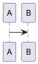

# 🎨 工具栏更新总结

## ✅ 完成的修改

### 1. **主工具栏按钮布局**

现在所有图表和数学公式功能都作为**主按钮**直接显示在工具栏中：

```
保存 | Emoji 标题 粗体 斜体 ... | 上传 表格 |
🎨Mermaid 🏗️PlantUML 📈ECharts 🎼五线谱 🧮数学公式 🔢行内公式 |
撤销 重做 | 编辑模式 | 更多选项
```

### 2. **按钮图标优化**

所有按钮图标现在使用 `currentColor`，会自动适应 VS Code 的主题色：

- 🎨 **Mermaid** - 流程图图标
- 🏗️ **PlantUML** - UML 图表图标
- 📈 **ECharts** - 数据图表图标
- 🎼 **五线谱** - 音乐五线谱图标
- 🧮 **数学公式块** - 数学公式块图标
- 🔢 **行内数学公式** - 行内数学公式图标

### 3. **快捷键配置**

| 功能 | 快捷键 | 用途 |
|------|--------|------|
| Mermaid 图表 | ⌘+Shift+M | 插入 Mermaid 图表 |
| PlantUML 图表 | ⌘+Shift+P | 插入 PlantUML 图表 |
| ECharts 图表 | ⌘+Shift+E | 插入 ECharts 图表 |
| 五线谱 | ⌘+Shift+N | 插入 ABC 记谱法五线谱 |
| 数学公式块 | ⌘+Shift+B | 插入数学公式块 |
| 行内数学公式 | ⌘+Shift+I | 插入行级数学公式 |

### 4. **vditor 配置优化**

```typescript
preview: {
  // 数学公式配置
  math: {
    inlineDigit: true,
    engine: 'KaTeX', // 使用 KaTeX 渲染引擎
    macros: { "\\f": "#1f(#2)" }
  },

  // 图表功能全部启用
  mermaid: true,        // Mermaid 图表
  echarts: true,        // ECharts 图表
  abc: true,            // ABC 记谱法（五线谱）
  plantuml: true,       // PlantUML 图表
  chart: true,          // 通用图表
  flowchart: true,      // 流程图
  sequence: true,       // 序列图

  // PlantUML 渲染配置
  plantumlServer: 'https://www.plantuml.com/plantuml/png/',
  plantumlServerList: [
    'https://www.plantuml.com/plantuml/png/',
    'https://plantuml-server.kkeisuke.app/png/',
    'http://www.plantuml.com/plantuml/png/'
  ],
  plantumlRenderMode: 'local',

  // 其他配置
  mode: 'both',         // 编辑+预览模式
  cdn: 'https://cdn.jsdelivr.net/npm/vditor@3.11.2',
  ext: true,            // 启用扩展
}
```

## 🎯 **PlantUML 渲染问题解决方案**

### 可能的问题和解决方案：

1. **网络连接问题**
   - 添加了多个 PlantUML 服务器备选
   - 支持本地渲染模式

2. **浏览器缓存问题**
   - 清除浏览器缓存
   - 强制刷新页面 (Ctrl+F5)

3. **CDN 资源加载失败**
   - 使用官方 CDN
   - 配置多个备用服务器

### 测试步骤：

1. **使用 F5 启动调试模式**
2. **打开 `plantuml-test.md` 文件**
3. **切换到预览模式查看渲染效果**
4. **如果 PlantUML 不显示，尝试 Mermaid 替代方案**

## 📁 **新增文件**

- `toolbar-update-summary.md` - 本更新总结文档
- `plantuml-test.md` - PlantUML 专用测试文件
- `test-plantuml.md` - 完整功能测试文件

## 🚀 **使用方法**

### 方法一：点击工具栏按钮
1. 点击相应的图表或数学公式按钮
2. 编辑器会自动插入模板
3. 修改模板内容
4. 在预览模式查看效果

### 方法二：使用快捷键
1. 将光标放在要插入的位置
2. 按下对应的快捷键
3. 编辑器会插入模板
4. 继续编辑

### 方法三：手动输入
直接使用以下语法格式：

```markdown
# Mermaid


# PlantUML


# ECharts
```echarts
{
  "xAxis": {...},
  "series": [...]
}
```

# 五线谱
```abc
K:C
C D E F
```

# 数学公式块
$$
E = mc^2
$$

# 行内数学公式
$F = ma$
```

## ✨ **特色功能**

1. **主题自适应** - 按钮图标自动适应 VS Code 主题
2. **智能模板** - 每个功能都包含实用的示例模板
3. **多服务器支持** - PlantUML 配置了多个渲染服务器
4. **快捷键支持** - 提高编辑效率
5. **实时预览** - 所见即所得的编辑体验

## 🔧 **技术实现**

- **前端构建**: Bun + TypeScript
- **编辑器核心**: vditor 3.11.2
- **数学渲染**: KaTeX
- **图表渲染**: Mermaid, ECharts, PlantUML 内置引擎
- **音乐渲染**: ABC 记谱法

---

现在你可以在 VS Code 中享受功能强大的 Markdown 编辑体验！🎉